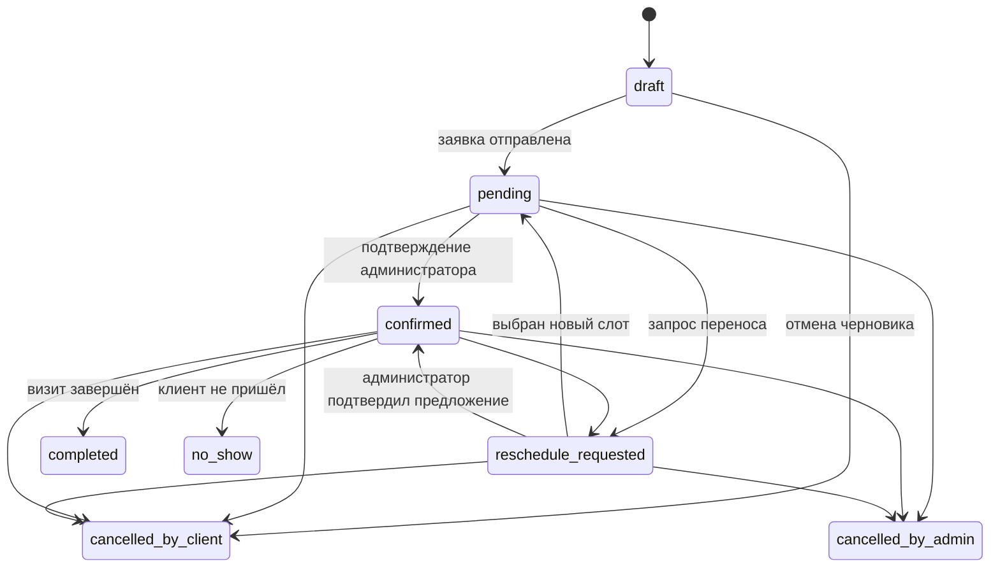

# State machine записи

| Статус | Значение | Разрешённые переходы |
| --- | --- | --- |
| `draft` | Неполная запись, ещё не заявка | `pending`, `cancelled_by_client` |
| `pending` | Отправлена, ожидает решения | `confirmed`, `reschedule_requested`, `cancelled_by_client`, `cancelled_by_admin` |
| `confirmed` | Время закреплено | `reschedule_requested`, `cancelled_by_client`, `cancelled_by_admin`, `completed`, `no_show` |
| `reschedule_requested` | Идёт подбор нового времени | `pending`, `confirmed`, `cancelled_by_client`, `cancelled_by_admin` |
| `cancelled_by_client` | Отменил клиент | финальный |
| `cancelled_by_admin` | Отменила студия | финальный |
| `completed` | Услуга оказана | финальный |
| `no_show` | Клиент не пришёл | финальный |

Инварианты: pending/confirmed/reschedule_requested имеют актуальный slot; отмена освобождает слот и отменяет неотправленные уведомления; confirmed создаёт reminders; перенос в одной транзакции освобождает старый слот, бронирует новый и заменяет reminders. Повторная команда, ведущая к текущему состоянию, возвращает существующий результат без побочных действий. Любой иной переход — domain error и аудит отказа.

